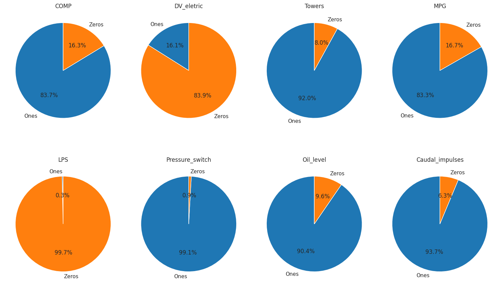

# 📚 Course Project 1 📚 

## 👥 Team Name : Fab Five 👥

## 🧑‍🤝‍🧑 Contributors 🧑‍🤝‍🧑

| Student ID   | Name       | Project Task                       |
|--------------|------------|-----------------------------------|
| 202001402    | Aditya Nawal    | Prediction of Oil temperature    |
| 202001410    | Ayush Patel     | Prediction of Motor current      |
| 202001441    | Priyanshi Parmar | Prediction of H1 pressure        |
| 202001450    | Parth Thakrar      | Prediction of TP2 pressure       |
| 202103008   | Rishit Vaghela   | Prediction of Tower signal       |

The first four problems are based on regression. After discussing the potential problem statements and determining target variables, we divided the problem statements. This allowed us to concentrate on finding a solution to a particular problem and this way we could have a thorough look at different aspects of the dataset. Additionally, we encountered a fifth problem, which falls under the category of binary classification. 

## NOTE: Please consider only `.ipynb` and `README.md` files. Ignore `img` folder and `.png` files. They are used for representation in `README.md` file.

# 🎯 Task 1 : Dataset and Project Overview

This data mining project aims to predict various parameters related to a compressor system. The dataset consists of 15,169,48 data points collected at 1Hz from February to August 2020. The dataset contains the following features:

- **Timestamp**: Represents the time at which each data point was recorded.
- **TP2 (bar)**: Measure of the pressure on the compressor.
- **TP3 (bar)**: Measure of the pressure generated at the pneumatic panel.
- **H1 (bar)**: Measure of the pressure generated due to pressure drop when the discharge of the cyclonic separator filter occurs.
- **DV pressure (bar)**: Measure of the pressure drop generated when the towers discharge air dryers. A zero reading indicates that the compressor is operating under load.
- **Reservoirs (bar)**: Measure of the downstream pressure of the reservoirs, which should be close to the pneumatic panel pressure (TP3).
- **Motor Current (A)**: Measure of the current of one phase of the three-phase motor.
- **Oil Temperature (ºC)**: Measure of the oil temperature on the compressor.
- **COMP**: Electrical signal of the air intake valve on the compressor.
- **DV electric**: Electrical signal that controls the compressor outlet valve.
- **TOWERS**: Electrical signal that defines the tower responsible for drying the air and draining humidity.
- **MPG**: Electrical signal responsible for starting the compressor under load.
- **LPS**: Electrical signal that detects and activates when the pressure drops below 7 bars.
- **Pressure Switch**: Electrical signal that detects the discharge in the air-drying towers.
- **Oil Level**: Electrical signal that detects the oil level on the compressor.
- **Caudal Impulse**: Electrical signal that counts the pulse outputs generated by the absolute amount of air flowing from the APU to the reservoirs.

## 📄 Dataset Details:
- **Dataset Size**: 15,169,48 data points.
- **Null Values**: There are no null values present in the dataset.

| Attribute Category                            | Data Type             | Columns               |
|---------------------------------------|-----------------------|-----------------------|
| Timestamp                             | DateTime (YYYY-MM-DD HH:MM:SS)              | Timestamp               |
| Analog Sensor Measurements            | Float                 | TP2, TP3, H1, DV Pressure, Reservoirs, Oil Temperature, Motor Current      |
| Digital Sensor Measurements           | Binary (0 or 1)        | COMP, DV Electric, Towers, MPG, LPS, Pressure Switch, Oil Level, Caudal Impulse      |

## 📈 Statistical Summary of Each Attributes

## 👀 Observations:

- The data ranges, as indicated by the minimum and maximum values, vary for different attributes. For example, attributes like "TP2," "H1," and "DV_pressure" have negative values, while others have positive values.
- The mean values provide an understanding of the average levels or magnitudes of the attributes. For example, "Oil_temperature" has a mean value of approximately 62.64.
- The standard deviation values indicate the spread or variability of the data around the mean. Larger standard deviations suggest more diverse or scattered values, while smaller standard deviations indicate relatively tighter clusters of values. Oil temperature has the largest standard deviation while DV pressure has the lowest.
- Comparing mean and median allows us to determine any skewness present in the data.

    - **Positively Skewed Column (Right-Skewed): Oil_temperature**

        - Mean: 62.64418
        - Median (50th percentile): 62.7

        In this example, the mean (62.64418) is slightly less than the median (62.7). When the mean is less than the median, it indicates that the data is left-skewed. In a left-skewed distribution, the tail on the left side of the distribution is longer or fatter than the right side. This suggests that there may be some unusually low values (outliers) that are pulling the mean to the left.

    - **Negatively Skewed Column (Left-Skewed): DV_pressure**

        - Mean: 0.055956
        - Median (50th percentile): -0.02

        In this example, the mean (0.055956) is greater than the median (-0.02). When the mean is greater than the median, it indicates that the data is right-skewed. In a right-skewed distribution, the tail on the right side of the distribution is longer or fatter than the left side. This means that there may be some unusually high values (outliers) that are pulling the mean to the right.

## 📦 BOX PLOTS

The box plot offers a visual depiction of the dataset, aiding in data analysis. It enables us to assess the data's central tendency through the median's position within the plot. Additionally, the box's length provides insights into data spread, with longer boxes signifying greater variability and shorter ones indicating less. Moreover, it facilitates the identification of outliers, which can be subsequently removed from the dataset to enhance the efficiency of model training.

The box plot also helps us gauge the skewness of the data distribution. When the box is closer to the right end, as observed in the box plot for oil temperature, it indicates a positive skew. Conversely, when it leans towards the left end, as evident in the DV pressure box plot, it signifies negative skewness.

## 🥟 Pie Charts

The pie charts showing the number of ones and zeros in the dataset's binary features are like helpful snapshots. They let us see if there are a lot more of one type than the other. This is important because it helps us get our data ready for making predictions. It's like making sure we have a fair and balanced set of information to teach our model. These charts also help us spot any unusual patterns, which could be a sign of something important that needs looking into.

## 🕒 Time Series Plots

## 🧐 EDA and Other Insights

Mentioned in respective `.ipynb` files.

# 🎯 Task 2: Regression Problems

### 1. Oil Temperature Prediction 🌡️

- **Equipment Maintenance:** Knowing the oil temperature in machinery, such as engines or turbines, is crucial for preventive maintenance. If the temperature is predicted to rise beyond safe levels, maintenance can be scheduled to prevent overheating and potential damage.

- **Energy Efficiency:** Accurate oil temperature predictions can optimize the efficiency of equipment. By maintaining the right temperature, energy consumption can be reduced, leading to cost savings and environmental benefits.

### 2. Motor Current Prediction ⚡

- **Fault Detection:** Predicting motor current can help detect abnormal conditions or faults in electrical motors. Sudden spikes or deviations from the predicted values may indicate motor issues, allowing for timely maintenance or replacement.

- **Energy Management:** Monitoring motor current can aid in energy management and load balancing. Predictive models can help schedule equipment operation during off-peak hours, reducing energy costs.

### 3. H1 Pressure Prediction 💥

- **Process Control:** In industrial processes, maintaining the correct pressure is crucial for quality control and safety. Predicting H1 pressure allows for real-time adjustments to ensure the process remains within desired parameters.

- **Safety:** Predictive models can help in early detection of pressure anomalies that may pose safety risks. Alerts can be generated when pressure deviates from expected values, preventing accidents.

### 4. TP2 Pressure Prediction 🌀

- **Pipeline Monitoring:** In applications involving pipelines (e.g., in the oil and gas industry), predicting TP2 pressure is vital for maintaining the integrity of the pipeline system. Sudden pressure drops or spikes can be early indicators of leaks or other issues.

- **Resource Allocation:** Predictive models can optimize the allocation of resources such as pumping stations. By forecasting TP2 pressure, operators can schedule pump operations efficiently, minimizing energy consumption.

### 5. Tower Prediction 🌀

- **Maintainence:** The towers remove moisture from compressed air to prevent corrosion and ensure the proper operation of pneumatic components, while also regulating air pressure to meet the distinct requirements of various devices and components across the train.

- **Air Regulation:** Towers can serve as reservoirs for storing compressed air. These reservoirs help maintain a consistent and readily available air supply for various pneumatic functions onboard the metro train.

### 🧩 **Most Interesting Problem**

After studying these problems, we found that predicting **oil temperature** is the most interesting problem out of the four regression problems. This choice is based on several factors:

- **Health:** If the oil temperature gets too high, it can lead to damage to the compressor's components.
- **Performance:** Accurate predictions can prevent overheating, which can cause the compressor to run less efficiently.
- **Efficiency:** Operating the compressor at the optimal oil temperature ensures that it uses energy efficiently.
- **Safety:** Being able to accurately predict and control the oil temperature helps to prevent accidents and injuries.

Overall, predicting oil temperature is the most interesting problem because it has a significant impact on the compressor's well-being and operation.

# 🎯 Task 3

Results of End-to-End ML pipeline are mentioned in respective `.ipynb` files.
