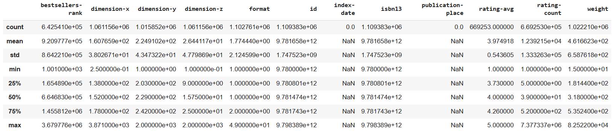
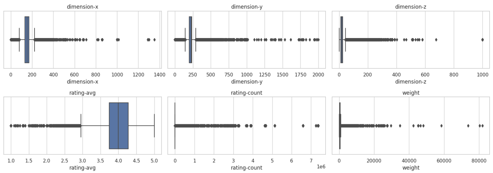
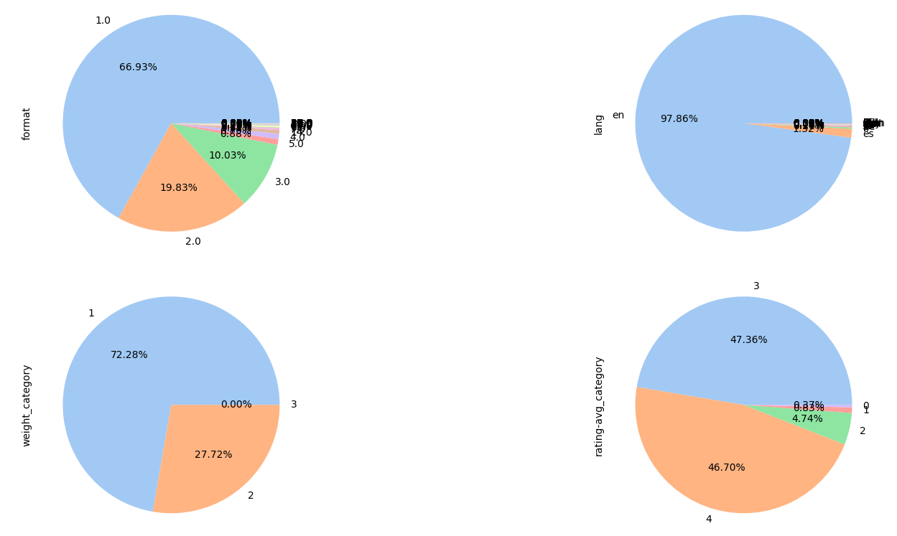

# 📚 Course Project 2 📚 

## 👥 Team Name : Fab Five 👥

## 🧑‍🤝‍🧑 Contributors 🧑‍🤝‍🧑

| Student ID   | Name       | Project Task                       |
|--------------|------------|-----------------------------------|
| 202001402    | Aditya Nawal    | Prediction of language of books    |
| 202001410    | Ayush Patel     | Prediction of weight and rating average category      |
| 202001441    | Priyanshi Parmar | Prediction of weight and rating average category        |
| 202001450    | Parth Thakrar      | Prediction of weight and rating average category       |
| 202103008   | Rishit Vaghela   | Prediction of language of books      |

We had to transform the weight and rating average, initially represented as floating-point values, into distinct classes to address a classification problem. We explored various models and employed diverse ensemble techniques to enhance the accuracy of our predictions. Additionally, we conducted preprocessing tasks prior to training the models, including converting dates into the number of days elapsed and grouping categories through clustering due to the presence of a considerable number of categories.

## NOTE: Please consider only `.ipynb` and `README.md` files. Ignore `img` folder and `.png` files. They are used for representation in `README.md` file.

# 🎯 Task 1: Dataset and Project Overview

## 📂 Dataset Description

The dataset for this project comprises several files, with the main `dataset.csv` at its core, and additional files serving as lookup tables for categories, authors, formats, and publication places. 

📄 **Files:**

- `dataset.csv`: The primary dataset file containing information about various books.
- `categories.csv`: A lookup table for book categories, with mappings to category IDs.
- `authors.csv`: A lookup table for book authors, assisting in author identification.
- `formats.csv`: A lookup table for book formats, with format IDs and their corresponding descriptions.
- `places.csv`: A lookup table for publication places, providing additional context for book origins.

## 📝 Fields

- **authors**: A list of the author(s) of the book.
- **bestsellers-rank**: The ranking of the book as a bestseller, represented as an integer.
- **categories**: A list of category IDs to which the book belongs. For category mappings, refer to the `authors.csv` file.
- **description**: A textual description of the book.
- **dimension_x**: The dimension of the book in the X direction, in centimeters (float value).
- **dimension_y**: The dimension of the book in the Y direction, in centimeters (float value).
- **dimension_z**: The dimension of the book in the Z direction, in millimeters (float value).
- **edition**: Information about the book's edition.
- **edition-statement**: Additional details regarding the book's edition.
- **for-ages**: A range indicating the suitable age group for the book's readers.
- **format**: The book's format, represented by an integer. For format descriptions, consult the `formats.csv` file.
- **id**: A unique identifier for each book, represented as an integer.
- **illustrations-note**: Notes related to illustrations in the book.
- **imprint**: Information about the book's publisher or imprint.
- **index-date**: The date when the book's data was crawled or retrieved.
- **isbn10**: The book's ISBN-10 (International Standard Book Number) in string format.
- **isbn13**: The book's ISBN-13 (International Standard Book Number) in string format.
- **lang**: A list of the language(s) in which the book is available.
- **publication-date**: The date when the book was published.
- **publication-place**: An identifier for the book's place of publication. Reference `places.csv` for more details.
- **publisher**: The name of the book's publisher.
- **rating-avg**: The average rating of the book on a scale from 0 to 5, represented as a floating-point value.
- **rating-count**: The number of ratings received by the book.
- **title**: The title of the book.
- **url**: The relative URL for the book, constructed as "https://bookdepository.com" + the provided URL.
- **weight**: The weight of the book in grams, represented as a floating-point value.

## 📊 Dataset Details

The dataset used for this project contains the following details:

### 📏 Size

- Size: 1,109,383 entries

### 🚫 Null Values

The dataset includes null values in various fields. Here is a summary of the number of null values for each field:

| Field                | Null Values |
|----------------------|-------------|
| authors              | 0           |
| bestsellers-rank     | 466,842     |
| categories           | 0           |
| description          | 80,087      |
| dimension-x          | 48,227      |
| dimension-y          | 93,531      |
| dimension-z          | 48,227      |
| edition              | 926,569     |
| edition-statement    | 747,261     |
| for-ages             | 1,033,390   |
| format               | 6,622       |
| id                   | 0           |
| illustrations-note   | 752,907     |
| image-checksum       | 27          |
| image-path           | 27          |
| image-url            | 27          |
| imprint              | 830,049     |
| index-date           | 1,109,383   |
| isbn10               | 0           |
| isbn13               | 0           |
| lang                 | 60,407      |
| publication-date     | 2,603       |
| publication-place    | 1,109,383   |
| rating-avg           | 440,130     |
| rating-count         | 440,130     |
| title                | 0           |
| url                  | 0           |
| weight               | 87,173      |

### 📝 Attribute Types

The dataset contains various attribute types. Here are the attribute types for each field:

- **Date**: publication date
- **Float**: Features such as bestsellers-rank, dimension-x, dimension-y, dimension-z, format, index-date, publication-place, rating-avg, rating-count, and weight
- **String**: description, edition, edition-statement, illustrations-note, image-path, image-url, lang, title, and url
- **Int**: id and isbn13
- **List of int**: authors and categories

## 📈 Summary of each attribute:

## 👀 Observations

The following observations provide insights into the data distribution:

1. **Mean Values:** The mean values give us an understanding of the average levels or magnitudes of the attributes. For example, "dimension-x" has a mean value of approximately 160.76.

2. **Standard Deviation:** The standard deviation values indicate the spread or variability of the data around the mean. Larger standard deviations suggest more diverse or scattered values, while smaller standard deviations indicate relatively tighter clusters of values. In your dataset, oil temperature has the largest standard deviation while DV pressure has the lowest.

3. **Skewness Comparison:** Comparing mean and median allows us to determine any skewness present in the data.

   - **Negatively Skewed Column (Left-Skewed): dimension-y**
     - Mean: 224.91
     - Median (50th percentile): 229
     - In this example, the mean (224.91) is slightly less than the median (229). When the mean is less than the median, it indicates that the data is left-skewed. In a left-skewed distribution, the tail on the left side of the distribution is longer or fatter than the right side. This suggests that there may be some unusually low values (outliers) that are pulling the mean to the left.

   - **Positively Skewed Column (Right-Skewed): dimension-x**
     - Mean: 160.77
     - Median (50th percentile): 152
     - In this example, the mean (160.77) is greater than the median (152). When the mean is greater than the median, it indicates that the data is right-skewed. In a right-skewed distribution, the tail on the right side of the distribution is longer or fatter than the left side. This means that there may be some unusually high values (outliers) that are pulling the mean to the right.

## 📦 Box Plots

The box plot offers a visual depiction of the dataset, aiding in data analysis. It enables us to assess the data's central tendency through the median's position within the plot. Additionally, the box's length provides insights into data spread, with longer boxes signifying greater variability and shorter ones indicating less. Moreover, it facilitates the identification of outliers, which can be subsequently removed from the dataset to enhance the efficiency of model training.

The box plot also helps us gauge the skewness of the data distribution. When the box is closer to the right end, as observed in the box plot for rating-avg, it indicates a positive skew. Conversely, when it leans towards the left end, as evident in the dimension-x box plot, it signifies negative skewness.

## 🥟 Pie Charts

1. We found that most of the books belong to the light weight category whereas the heavy weight books are minimal in number.
2. Most of the books are given higher ratings like 3 and 4.
3. Most of the books are written in English language.

## 🧐 EDA and Other Insights

Mentioned in respective `.ipynb` files.

# 🎯 Task 2: Classification Problem

## 1. Weight Prediction ⚖️

Predicting weight categories for books is important because it:

- Optimizes inventory management and storage efficiency.
- Aids in cost-effective logistics and shipping planning.
- Enhances customer experience and informs purchasing decisions.

## 2. Rating-avg Prediction ⭐

Predicting book rating classifications is important because it:

- Enables personalized book recommendations for readers.
- Helps publishers focus marketing efforts on target audiences.
- Guides content creation and improves overall reader satisfaction.

## 3. Language Prediction 🌐

Predicting language is important because it:

- Enhances user experience and helps readers find books in their preferred language, ensuring they can understand and enjoy the content.
- Aids in categorizing books by language, facilitating efficient inventory management and improved search functionality for libraries and online platforms.

# 🤩 Most Interesting Problem

After studying these classification problems, we found that predicting the "rating-avg" is the most interesting problem out of the three. This choice is based on several factors:

- **User Satisfaction**: Accurately predicting and classifying the average rating of a book provides valuable insights into user satisfaction and the quality of the content, aiding readers in their book selection.

- **Recommendation System Enhancement**: Improving the classification of books based on their average rating enables the enhancement of recommendation systems, ensuring that users receive more tailored book recommendations aligned with their preferences.

- **Informed Decision-Making**: Readers often consider a book's average rating when deciding what to read. Classifying books based on their rating average helps readers make informed decisions about book selection.

- **Author and Publisher Insights**: It provides valuable feedback to authors and publishers, helping them understand the reception of their work and make informed decisions about future publications.

- **Market and Genre Analysis**: Accurate classification of rating averages supports market and genre analysis in the publishing industry, allowing for the identification of trends and preferences among readers.

Overall, predicting the average rating of books is the most interesting classification problem because it directly impacts user satisfaction, informs decision-making, and contributes to the improvement of recommendation systems, benefiting both readers and the publishing industry.

# 🎯 Task 3

Results of End-to-End ML pipeline are mentioned in respective `.ipynb` files.