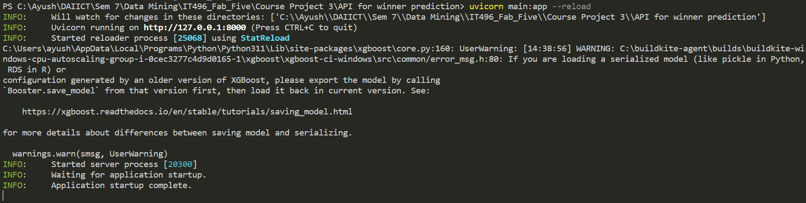
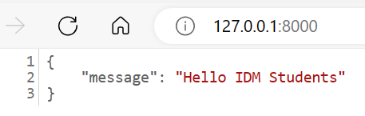
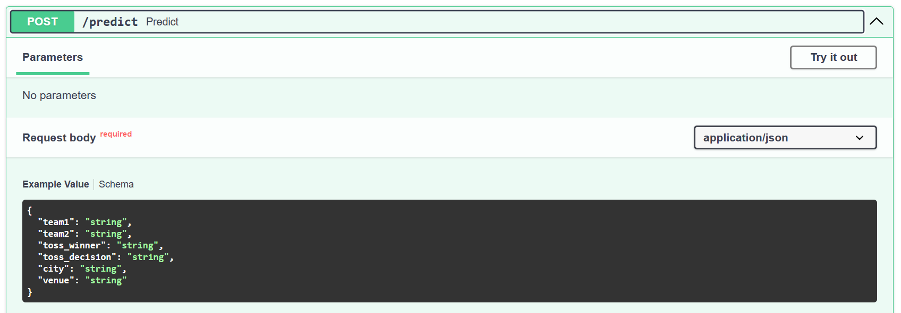
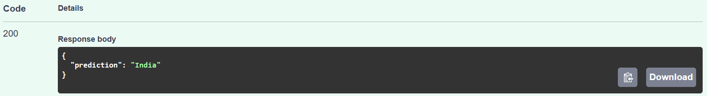

# 📚 Course Project 3 📚 

## 👥 Team Name : Fab Five 👥

<hr>

## 🧑‍🤝‍🧑 Contributors 🧑‍🤝‍🧑

| Student ID   | Name       | Project Task                       |
|--------------|------------|-----------------------------------|
| 202001402    | Aditya Nawal    | Player Dismissal Prediction    |
| 202001410    | Ayush Patel     | Rohit Sharma's Run, Finalist Team and World Cup Winner Prediction      |
| 202001441    | Priyanshi Parmar | Playing 11, Finalist Team and World Cup Winner Prediction |
| 202001450    | Parth Thakrar      | Rohit Sharma's Run, Finalist Team and World Cup Winner Prediction |
| 202103008   | Rishit Vaghela   | Toss Desicion Prediction |

<hr>

The project aims to leverage data mining techniques to enhance decision-making processes in the ODI Cricket World Cup 2023. Through predictive analytics, the project addresses three key aspects: player dismisal, toss decision, individual player performance prediction, match outcome forecasting, and playing 11 selection for the finalist teams.

## NOTE: Please consider only `.ipynb` and `README.md` files. Ignore `img` folder and `.png` files. They are used for representation in `README.md` file.

# 🏏 Project Overview

The project for the 2023 ODI Cricket World Cup employs data mining techniques to enhance decision-making. Through predictive analytics, it addresses player dismissal, toss decisions, individual player performance, match outcome forecasting, and optimal playing 11 selection for finalist teams. The overarching goal is to leverage data analysis for better decision-making in key aspects of the tournament, providing valuable insights for teams to improve their strategies and outcomes.

# 🎯 Dataset

## 📂 Dataset Info

The dataset used for this project comprises all data from 2002 to 2023 for ICC mens cricket teams. Data from 2002 to 2023 excluding 2023 world cup statistics is present in `2002_2023odidata` folder while data of 2023 world cup is present in `2023 world cup dataset` folder. 

## 📄 Files and Attributes

### 📝 1. `2002_2023odidata` comprises 1 csv file(`ODI_Match_info.csv`).

#### 📊 A. Below are the details of `ODI_Match_info.csv` :

- `id` : A unique identifier for each cricket match.
- `season` : The season or year in which the match took place.
- `city` : The city where the match was held.
- `date` : The date on which the match was played.
- `team1` : The name of the first cricket team participating in the match.
- `team2` : The name of the second cricket team participating in the match.
- `toss_winner` : The team that won the toss.
- `toss_decision` : The decision made by the toss-winning team (bat or field).
- `result` : The result of the match (e.g., "normal," "tie," "no result").
- `dl_applied` : An indicator of whether the Duckworth-Lewis method was applied (1 for applied, 0 for not applied).
- `winner` : The winning team of the match.
- `win_by_runs` : The margin of victory in runs (0 for wickets, if not applicable).
- `win_by_wickets` : The margin of victory in wickets (0 for runs, if not applicable).
- `player_of_match` : The player awarded the "Man of the Match" title.
- `venue` : The stadium or venue where the match was played.
- `umpire1` : The name of the first on-field umpire.
- `umpire2` : The name of the second on-field umpire.
- `umpire3` : The name of the third umpire (TV umpire).

### 📝 2. `2023 world cup dataset` comprises 3 csv file(`deliveries.csv`, `matches.csv`, `points_table.csv`).

#### 📈 A. Below are the details of `deliveries.csv` :

- `match_id`: Unique identifier for each cricket match.
- `season`: The specific season in which the cricket match took place.
- `start_date`: The date when the match started.
- `venue`: The location where the cricket match was held.
- `innings`: The inning number during which the event occurred.
- `ball`: The ball number within the inning.
- `batting_team`: The team currently batting.
- `bowling_team`: The team currently bowling.
- `striker`: The batsman facing the current ball.
- `non_striker`: The batsman at the non-striker's end.
- `bowler`: The player bowling the current ball.
- `runs_off_bat`: Runs scored off the bat on the current ball.
- `extras`: Additional runs scored, not from the bat (e.g., wides, no-balls).
- `wides`: The number of wide deliveries bowled.
- `noballs`: The number of no-ball deliveries bowled.
- `byes`: Runs scored as byes on the current ball.
- `legbyes`: Runs scored as leg-byes on the current ball.
- `penalty`: Penalty runs awarded on the current ball.
- `wicket_type`: Type of dismissal if a wicket fell on the current ball.
- `player_dismissed`: Batsman dismissed on the current ball.
- `other_wicket_type`: Additional information about the type of dismissal.
- `other_player_dismissed`: Additional player dismissed on the current ball.

#### 📉 B. Below are the details of `matches.csv` :

- `season`: The cricket season in which the match occurred.
- `team1`: The first team participating in the match.
- `team2`: The second team participating in the match.
- `date`: The date on which the match took place.
- `match_number`: Unique identifier for the match in the season.
- `venue`: The stadium or ground where the match was held.
- `city`: The city where the match was played.
- `toss_winner`: The team winning the toss.
- `toss_decision`: Decision taken by the toss-winning team (batting or bowling).
- `player_of_match`: The outstanding player of the match.
- `umpire1`: The first on-field umpire for the match.
- `umpire2`: The second on-field umpire for the match.
- `reserve_umpire`: The reserve umpire designated for the match.
- `match_referee`: The official responsible for overseeing the match.
- `winner`: The team that emerged victorious in the match.
- `winner_runs`: The margin of victory in terms of runs.
- `winner_wickets`: The number of wickets by which the winning team achieved victory.
- `match_type`: The type of cricket match (e.g., Test, One Day International, T20).


#### 📊C. Below are the details of `points_table.csv` :

- `Ranking`: The position or order of the team in the current standings.
- `Team`: The name of the cricket team.
- `Matches`: Total number of matches played by the team.
- `Won`: Number of matches won by the team.
- `Lost`: Number of matches lost by the team.
- `Tie`: Number of matches that ended in a tie for the team.
- `No Results`: Number of matches with no result for the team.
- `Points`: Total points accumulated by the team in the ranking.
- `Net Run Rate`: The net run rate calculated for the team.
- `Series Form`: Performance trend of the team in recent series.
- `Next Match`: Details of the team's upcoming match.
- `For`: Total runs scored by the team in all matches.
- `Against`: Total runs conceded by the team in all matches.

# ✨ Features and Functionalities:

## ⚾ Rohit Sharma's Total Runs Prediction:

- **Purpose:** To predict Rohit Sharma's total runs based on ball-by-ball data from previous matches in the World Cup 2023.
- **Features:** Utilizes historical performance data to forecast Rohit Sharma's batting performance given a specific number of deliveries faced.

## 👨🏻‍🤝‍👨🏻 Finalist team Prediction:
   
- **Purpose:** To predict the outcomes finalist team that which 2 team will play finals.
- **Features:** Head-to-head ODI data since 2002 is employed to train predictive models considering Team1, Team2, Toss Winner, City, and Venue as input parameters.

## 🏆 Match Winner Prediction using Fast API:

- **Purpose:** To provide real-time match winner predictions through a user-friendly interface.
- **Features:** Developed a Fast API that takes input parameters such as Team1, Team2, Toss Winner, City, and Venue to predict the winner by integrating the trained predictive models.

## 🥎 Playing 11 Selection for Finalist Teams:

- **Purpose:** To assist teams in making informed decisions about the composition of their playing 11 for the final match.
- **Features:** Utilizes player data since 2002, calculating batting and bowling ratings to select the top 6 batsmen and top 5 bowlers for each team based on their historical performance.

## 💥 Player Dismissal Prediction:

- **Purpose:** To predict the likelihood of a specific player's dismissal based on historical ball-by-ball data in the World Cup 2023.
- **Features:** Utilizes the player's performance data, including dismissal patterns, average runs scored, and recent form. Additional features may include the bowler's statistics against the specific player and the venue's conditions.

## ⚡ Toss Decision Prediction:

- **Purpose:** To predict the optimal decision (batting or bowling) a team should make after winning the toss in a match.
- **Features:** Analyzes historical data to determine the success rates of teams choosing to bat or bowl first at a particular venue, during specific weather conditions, and against particular opponents.


# 🧩 Key Significance:

- **Strategic Insights:** Offers strategic insights for teams and management based on predictive analytics.
- **Real-time Predictions:** Fast API allows real-time predictions for match winners, enhancing fan engagement.
- **Data-Driven Playing 11 Selection:** Employs historical player data to guide the selection of the best-performing players for the final match.

# 🎯 Approach for Predicting Rohit Sharma's Performance:

In predicting Rohit Sharma's performance for the upcoming deliveries, the following key features were considered:

### Innings Information 🏏
1. innings: Understanding which innings Rohit Sharma is currently playing is crucial. Player strategies and performance can differ significantly between the first and second innings.

### Bowling Team ⚾
1. bowling_team: The identity of the bowling team can influence a batsman's performance. Different teams have varied bowling line-ups with distinct strengths and weaknesses.

### Dynamic Metrics 📊
1. runs_off_bat: The target variable represents the runs scored off each ball. Predicting this allows us to accumulate the total runs for Rohit Sharma over a specified number of deliveries.
2. ball_left: The number of balls remaining in the innings provides context for predicting future performance.
3. run_rate: The current run rate of the team can impact a batsman's approach. A higher run rate might lead to more aggressive shots.
4. team_total: The cumulative team score influences a batsman's strategy. The context of the team's performance is crucial for predicting individual player contributions.
5. wickets_remaining: The number of wickets in hand affects a batsman's approach. More wickets in hand may lead to a more aggressive playing style.
6. target, runs_needed, required_run_rate: In limited-overs cricket, the target, runs needed, and required run rate are essential metrics influencing a batsman's decision-making.

### Player-Specific Metrics 📈
1. average, strike_rate: Calculated based on performance in the current World Cup, not considering matches played before. These metrics provide insights into Rohit Sharma's recent form and adaptability in the ongoing tournament.

# 🎯 Approach for Predicting Match Winner:

In predicting the outcome of ODI matches, the following key features were considered using head-to-head ODI cricket data since 2002:

### Team Information 🏏
1. Team1, Team2: The identity of the two teams involved in the match is fundamental. Team-specific performance metrics, historical confrontations, and playing styles contribute to match outcome predictions.

### Venue Details 🏟️
1. City, Venue: The city and venue provide insights into the playing conditions, pitch characteristics, and potential advantages for specific teams. Different venues may favor different playing styles and strategies.

### Toss Information 🎲
1. Toss Winner: The team winning the toss has the opportunity to make strategic decisions based on prevailing conditions, such as choosing to bat or bowl first.
2. Toss Decision: Whether the toss winner chooses to bat or bowl can significantly impact the match outcome, considering the pitch conditions and team strengths.

# 🎯 Approach for Predicting Playing 11:

In predicting the playing 11 for a particular team in the ODI Cricket World Cup 2023, the performance analysis is based on a dataset that includes all ODI matches since 2002. The selection process focuses on 15 players from the squad, evaluating batsmen and bowlers based on specific performance metrics.

### Batsman Selection 🏏
1. batting_team: Identifies the team for which the player is batting.
2. striker, batsman: Individual player identities.
3. Strike rate: The strike rate of each batsman, indicating their scoring efficiency.
4. average: The average batting calculated from all ODI matches since 2002, offering a comprehensive overview of a player's historical scoring performance.

### Bowler Selection ⚾
1. bowling_team: Identifies the team for which the player is bowling.
2. bowler: Individual player identities.
3. strike rate: The strike rate of each bowler, indicating their effectiveness in taking wickets.
4. average: The average bowling strike rate calculated from all ODI matches since 2002, providing insights into a bowler's historical wicket-taking capability.

# 🎯 Approach for Predicting Player Dismissal:

In predicting the likelihood of a player's dismissal, the following key features were considered:

### Batting team 🏏
1. batting_team: Identifies the team for which the player is batting.

### Bowling team ⚾
1. bowling_team: Identifies the team for which the player is bowling.

### Dynamic Metrics 📊
1. runs_off_bat: The target variable represents the runs scored off each ball. Predicting this allows us to accumulate the total runs for the player over a specified number of deliveries.
2. extras: The number of extras scored off each ball, including wides, no-balls, byes, leg-byes, and penalties.
3. wides: The number of wides bowled by the bowler.
4. noballs: The number of no-balls bowled by the bowler.
5. byes: The number of byes scored off each ball.
6. legbyes: The number of leg-byes scored off each ball.
7. penalty: The number of penalty runs scored off each ball.

# 🎯 Approach for Toss Decision Prediction:

In predicting the optimal decision (batting or bowling) a team should make after winning the toss in a match, the following key features were considered:

### Team Information 🏏
1. Team1, Team2: The identity of the two teams involved in the match is fundamental. Team-specific performance metrics, historical confrontations, and playing styles contribute to match outcome predictions.

### Venue Details 🏟️
1. City, Venue: The city and venue provide insights into the playing conditions, pitch characteristics, and potential advantages for specific teams. Different venues may favor different playing styles and strategies.

### Toss Information 🎲
1. Toss Winner: The team winning the toss has the opportunity to make strategic decisions based on prevailing conditions, such as choosing to bat or bowl first.
2. Toss Decision: Whether the toss winner chooses to bat or bowl can significantly impact the match outcome, considering the pitch conditions and team strengths.

# 🚀 Getting Started with Fast API 🚀

## 🐍 Installation

To get started with this project, clone this repository to your local machine. You will need to have [Python](https://www.python.org/) installed in order to run the website locally.

If you do not have Python installed, you can download it [here](https://www.python.org/downloads/).

## ⚙️ Install the dependencies

`requirements.txt` contains all the dependencies required to run the API. To install them, run the following command in your terminal:

```bash
pip install -r requirements.txt
```

## ▶️ Run the API

To run the API, open a terminal in the project directory and run the following command:

Run the following command to start the API

```bash
uvicorn main:app --reload
```

After running the above command, you will get below output in your terminal:



Now open your browser and go to `http://127.0.0.1:8000/` to access the API.

It will show you the following output:



This shows that our API is working fine.

Now to access the API, go to `http://127.0.0.1:8000/docs` in your browser.

Now head towards `POST /predict` section and click on it.

It will show you the following screen:



Now click on `Try it out` button and enter the following details in request body:

```bash
{
  "team1": "India",
  "team2": "South Africa",
  "toss_winner": "India",
  "toss_decision": "field",
  "city": "Ahmedabad",
  "venue": "Narendra Modi Stadium, Ahmedabad"
}
```

Now click on `Execute` button and you will get the following output:



This shows that Team India will win the match.

This is just a sample output. You can try out different combinations of input and get the output. But note that the input should be in the same format as shown above and input values should be present in `api_input_reference.csv` file present in the `API for winner prediction` folder.

<div align="center">

## 👏 Congratulations! 👏 
### 🚀 Your API is up and running for predicting match winners! 🚀

</div>